# Pipeline Spec 1-Page (Chot scope)

## 1) Muc tieu he thong

Xay dung he thong tom tat video theo pipeline 3 module, tach biet trach nhiem, ghep noi bang data contract, chay on dinh voi mock data va data that.

- System input: `raw_video.mp4`
- System output chinh:
  - `deliverables/<run_id>/summary_video.mp4`
  - `deliverables/<run_id>/summary_text.txt`
- Artifact ky thuat lien module:
  - `summary_script.json`
  - `summary_video_manifest.json`
  - `summary_video.mp4` (trong `artifacts/<run_id>/g7_assemble/`)
- Optional contract artifact:
  - `final_summary.json` (neu xuat bo sung)

## 2) Y tuong tong quat

1. Tach video goc thanh 2 luong thong tin: audio va hinh anh.
2. Dung AI de chuyen audio -> transcript text, image -> visual caption text.
3. Merge 2 luong text theo timeline de tao context da phuong thuc.
4. Dung AI tao script tom tat co cau truc.
5. Cat/ghep nhieu doan tu video goc de tao video tom tat cuoi, giu audio goc.

## 3) Pham vi va nhiem vu theo module

### Module 1 - Data Extraction

- Input:
  - `raw_video.mp4`
- Output:
  - `audio_16k.wav`
  - `keyframes/*.jpg`
  - `scene_metadata.json`
- Nhiem vu:
  - Tach audio 16kHz mono.
  - Detect scene, cat keyframe theo moc thoi gian.
  - Resize keyframe theo quy uoc runtime.
  - Ghi metadata map 1-1 giua timestamp va file keyframe.

### Module 2 - Perception AI

- Input:
  - `audio_16k.wav`
  - `keyframes/*.jpg`
  - `scene_metadata.json`
- Output:
  - `audio_transcripts.json`
  - `visual_captions.json`
- Nhiem vu:
  - Chay speech-to-text tren audio.
  - Chay visual captioning tren keyframe.
  - Chuan hoa timestamp + sap xep + lam sach text.

### Module 3 - Fusion, Reasoning, Video Assembly

- Input:
  - `audio_transcripts.json`
  - `visual_captions.json`
  - `raw_video.mp4`
- Output:
  - `summary_script.json`
  - `summary_video_manifest.json`
  - `summary_video.mp4`
- Nhiem vu:
  - Align transcript + caption tren cung truc timeline.
  - Tao context hop nhat de LLM sinh script tom tat.
  - Tao manifest cat/ghep tu danh sach segment.
  - Render video tom tat tu video goc theo manifest.

## 4) Data contract va nguyen tac tich hop

- Deliverable lien module (`summary_script.json`, `summary_video_manifest.json`) phai pass schema trong `contracts/v1/template/*.schema.json`.
- Artifact noi bo (`alignment_result.json`, `summary_script.internal.json`, `quality_report.json`) phai pass schema trong `docs/Reasoning-NLP/schema/*.schema.json`.
- Timestamp chuan bat buoc: `HH:MM:SS.mmm`.
- Relative path trong JSON dung theo workspace root.
- Key name theo schema, khong doi tuy y.
- Fail-fast: sai schema hoac sai timestamp thi dung pipeline ngay.

## 5) Quy tac output cuoi

- `summary_script.json` phai co day du:
  - `title`
  - `plot_summary`
  - `moral_lesson`
  - `segments[]`
- `summary_video_manifest.json` phai map duoc 1-1 voi `segments` trong script.
- `summary_video.mp4`:
  - Duoc cat/ghep tu `raw_video.mp4`.
  - `keep_original_audio` bat buoc = `true`.
  - Phat duoc, co audio, noi dung khop script segment.

## 6) Definition of Done (MVP)

1. Chay thong luong end-to-end voi 1 video mau.
2. 100% file giao tiep pass schema v1.
3. Thay mock data bang data that khong can sua logic merge.
4. Tao duoc 2 deliverable cuoi:
   - `deliverables/<run_id>/summary_video.mp4`
   - `deliverables/<run_id>/summary_text.txt`

## 7) End-to-end swimlane pipeline (runtime)

```mermaid
flowchart LR
  %% LANE 1: ORCHESTRATOR
  subgraph L1[Orchestrator / Runtime]
    O1[Load config\npriority: CLI > ENV > JSON > default]
    O2[Preflight\ncheck input video + ffmpeg/ffprobe]
    O3[Run Module 1]
    O4[Run Module 2]
    O5[Run Module 3 G1->G8]
    O6[Publish deliverables]
    O7[End run]
    O1 --> O2 --> O3 --> O4 --> O5 --> O6 --> O7
  end

  %% LANE 2: MODULE 1
  subgraph L2[Module 1 - Extraction]
    M1A[Scene detection\nPySceneDetect]
    M1B[Extract audio\n16kHz mono WAV]
    M1C[Extract keyframes\n+ resize 336/448]
    M1D[Build scene_metadata.json\nmap frame_id to timestamp to file_path]
    M1A --> M1B
    M1A --> M1C --> M1D
  end

  %% LANE 3: MODULE 2
  subgraph L3[Module 2 - Perception]
    M2A[ASR Faster-Whisper\n-> audio_transcripts.json]
    M2B[Visual caption BLIP\n-> visual_captions.json]
    M2C[Handoff validation\nschema/timestamp/order/non-empty]
    M2A --> M2C
    M2B --> M2C
  end

  %% LANE 4: MODULE 3 (GATES)
  subgraph L4[Module 3 - Reasoning NLP]
    G1[G1 Validate + Normalize input\nstrict_contract_v1 or legacy_member1\nprobe source duration]
    G2[G2 Align\nadaptive delta + deterministic tie-break\nconfidence/fallback]
    G3[G3 Build context blocks\nImage at timestamp plus Dialogue]
    G4[G4 Summarize internal\nLLM -> parse/repair/grounding\nsummary_script.internal.json]
    G5[G5 Segment plan + map deliverable\nsummary_script.json + summary_video_manifest.json]
    G6[G6 Manifest checks\ncross-file consistency]
    G7[G7 Assemble video\nffmpeg cut/concat\nkeep_original_audio=true]
    G8[G8 QC\nmetrics + thresholds + report]
    G1 --> G2 --> G3 --> G4 --> G5 --> G6 --> G7 --> G8
  end

  %% LANE 5: DATA / ARTIFACTS
  subgraph L5[Data and Artifacts]
    D0[(Data/raw/video1.mp4)]
    D1[(Data/processed/VIDEO_NAME/extraction/audio/audio_16k.wav)]
    D2[(Data/processed/VIDEO_NAME/extraction/keyframes/*.jpg)]
    D3[(Data/processed/VIDEO_NAME/extraction/scene_metadata.json)]
    D4[(Data/processed/VIDEO_NAME/extraction/audio_transcripts.json)]
    D5[(Data/processed/VIDEO_NAME/extraction/visual_captions.json)]

    A1[(artifacts/RUN_ID/g1_validate/normalized_input.json)]
    A2[(artifacts/RUN_ID/g2_align/alignment_result.json)]
    A3[(artifacts/RUN_ID/g3_context/context_blocks.json)]
    A4[(artifacts/RUN_ID/g4_summarize/summary_script.internal.json)]
    A5[(artifacts/RUN_ID/g5_segment/summary_script.json)]
    A6[(artifacts/RUN_ID/g5_segment/summary_video_manifest.json)]
    A7[(artifacts/RUN_ID/g6_manifest/manifest_validation.json)]
    A8[(artifacts/RUN_ID/g7_assemble/summary_video.mp4)]
    A9[(artifacts/RUN_ID/g8_qc/quality_report.json)]
    A10[(artifacts/RUN_ID/g8_qc/summary_text.internal.json)]

    F1[(deliverables/RUN_ID/summary_video.mp4)]
    F2[(deliverables/RUN_ID/summary_text.txt)]
  end

  %% ORCHESTRATOR <-> MODULES
  O3 --> M1A
  O4 --> M2A
  O4 --> M2B
  O5 --> G1
  O6 --> F1
  O6 --> F2

  %% DATA FLOW
  D0 --> M1A
  D0 --> M1B
  D0 --> G7

  M1B --> D1
  M1C --> D2
  M1D --> D3

  D1 --> M2A
  D2 --> M2B
  D3 --> M2B

  M2A --> D4
  M2B --> D5

  D4 --> G1
  D5 --> G1

  G1 --> A1
  G2 --> A2
  G3 --> A3
  G4 --> A4
  G5 --> A5
  G5 --> A6
  G6 --> A7
  G7 --> A8
  G8 --> A9
  G8 --> A10

  A8 --> F1
```

