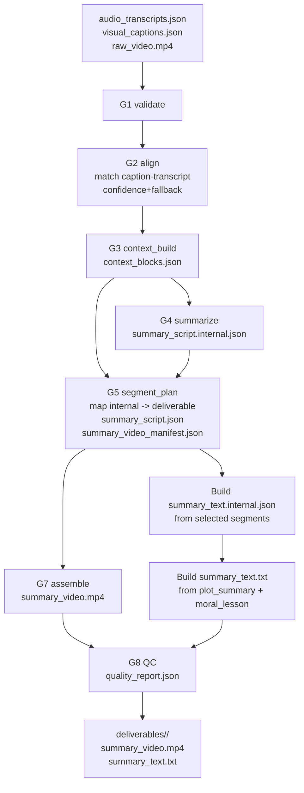

# Pipeline Flow and Grounding

Tai lieu nay mo ta luong du lieu thuc te trong runtime G1->G8, cach he thong tom tat video, va cach runtime tao summary text + provenance noi bo.

## 1) End-to-end flow



## 2) Logic view (video vs text)

```text
INPUTS
  |- transcripts
  |- captions
  |- raw_video

ALIGN + CONTEXT
  |- context_blocks[timestamp, image_text, dialogue_text, confidence, fallback_type]

VIDEO SUMMARY LANE
  |- planner scores context blocks
  |- planner computes dynamic target_count and segment durations
  |- summary_script.json + summary_video_manifest.json
  |- ffmpeg render -> summary_video.mp4

TEXT SUMMARY LANE (runtime hien tai)
  |- read selected segments from summary_script.json
  |- build summary_text.internal.json
  |    |- sentences[].text
  |    |- sentences[].support_segment_ids
  |    |- sentences[].support_timestamps
  |- build summary_text.txt from plot_summary + moral_lesson

QC LANE
  |- classic metrics: parse/timeline/grounding/compression/audio/render
  |- consistency metrics: grounded_ratio/coverage/order/overlap/cta_leak
```

## 3) Runtime contract for summary text

- Muc tieu: text cuoi parse-safe, khong prompt leakage/CTA va phu hop noi dung tong quat.
- Nguon su that cuoi: `summary_script.json` (segments da chon).
- Moi cau trong `summary_text.internal.json` phai co provenance:
  - `support_segment_ids`
  - `support_timestamps`
- Runtime hien tai tao `summary_text.txt` truc tiep tu `summary_script.internal.{plot_summary,moral_lesson}` sau khi loc an toan.
- `summary_text.internal.json` duoc ghi de truy vet provenance/coverage va tinh metric text-video consistency.

## 4) Dynamic segment planning (runtime behavior)

- Planner tinh `target_total_ms` tu budget + duration video (neu co ratio thi uu tien ratio).
- Planner suy ra `target_count` dong, khong hard-cap 3.
- Runtime co tran operational `target_count <= 15` de giu on dinh van hanh.
- Planner chon anchor theo bucket coverage mem + diversity penalty.
- Duration moi segment duoc chia theo remaining budget va clamp trong min/max duration.
- CTA/noise/prompt leakage duoc phat hien va giam uu tien.

## 5) Consistency metrics in quality_report

Ngoai cac metric co san, report co them:

- `text_sentence_grounded_ratio`
- `text_segment_coverage_ratio`
- `text_temporal_order_score`
- `text_video_keyword_overlap`
- `text_cta_leak_ratio`

Nhung metric nay dung de bat mismatch giua video summary va summary text.

## 6) Sequence diagram (runtime call flow)


